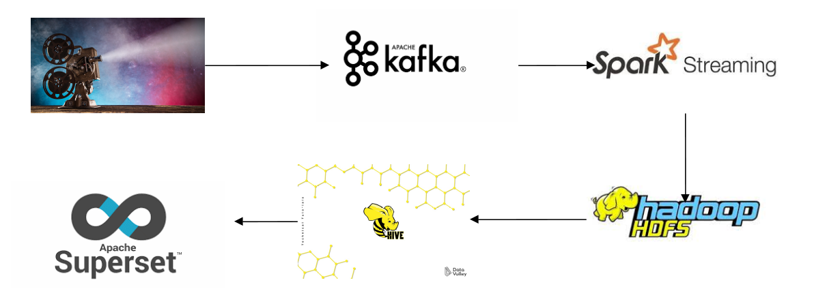
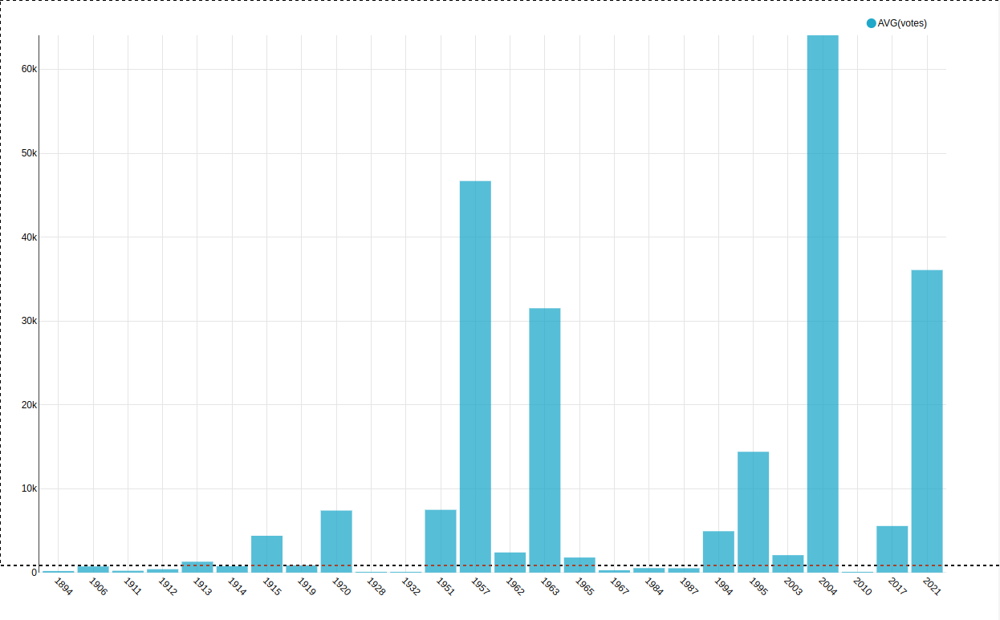

# Chuc nang he thong
- Khảo sát và phân tích movie qua các năm.
# Mo hinh hoat dong 

- Thu nhập và làm sạch dữ liệu.
- Kafka: stream đổ dữ liệu vào topic.
- Spark Streaming: đẩy data lưu trữ vào hdfs.
- Hdfs : lưu trữ dữ liệu.
- Superset: Truy vấn và tạo dashboard

#kafka
- Kafka được chạy trên server 172.17.80.28 topic minhnx12

#Câu lệnh kết nối bằng beeline với khi yêu cầu user password ấn enter
- beeline
- !connect jdbc:hive2://0.0.0.0:10015/
- Câu lệnh tạo hive table từ hdfs để truy vấn với superset:
  + CREATE TABLE IF NOT EXISTS minhnx12_test (title STRING, year STRING, rating STRING, runtime STRING, kind STRING, color_info STRING, votes STRING, country STRING, day STRING,month STRING ) ROW FORMAT DELIMITED FIELDS TERMINATED BY ',' STORED AS PARQUET LOCATION "/user/minhnx12/final/checkpoint
";
  
#spark submit trên 172.17.80.21
- spark-submit --deploy-mode client --packages org.apache.spark:spark-sql-kafka-0-10_2.11:2.4.0 --class com.example.btl.sparkss.SparkSS btl-1.0-SNAPSHOT.jar

#Superset dashboard

